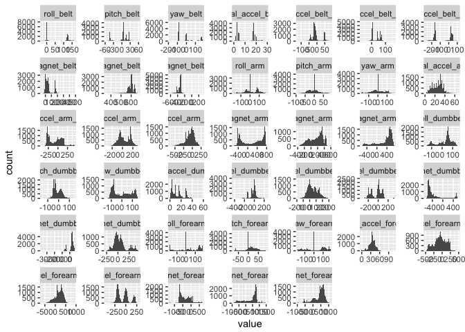
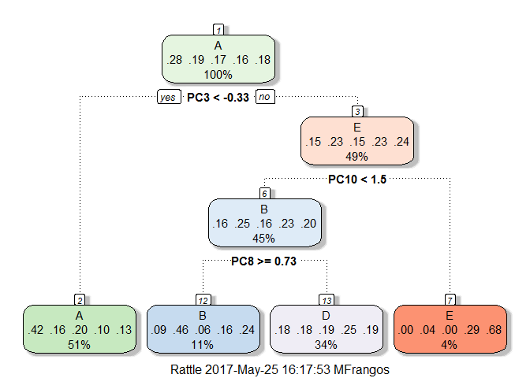
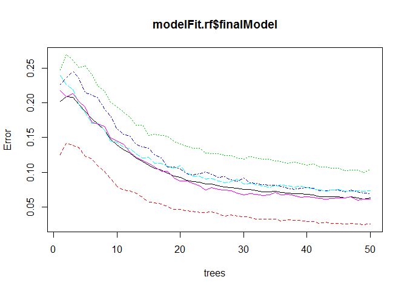

# Practical Machine Learning - Predicting correctness of Weight Lifting Exercises
Michalis Frangos  
25 May 2017  


# Project Summary
This report is **just an example** on cleaning data, feature selection, model fitting, and prediction, for the purpose of completing the course on Practical Machine Learing in Coursera.

The goal of the project is to:

- use data from accelerometers on the belt, forearm, arm, and dumbell of 6 participants
- predict the manner in which they did an exercise

The report briefly discusses:

- how the model was build
- how cross validation was used
- the choices made for building the predictive model
- the expected out of sample error
- the model predictions on 20 different test cases


##Background
Using devices such as Jawbone Up, Nike FuelBand, and Fitbit it is now possible to collect a large amount of data about personal activity relatively inexpensively. These type of devices are part of the quantified self movement - a group of enthusiasts who take measurements about themselves regularly to improve their health, to find patterns in their behavior, or because they are tech geeks. One thing that people regularly do is quantify how much of a particular activity they do, but they rarely quantify how well they do it. In this project, your goal will be to use data from accelerometers on the belt, forearm, arm, and dumbell of 6 participants. They were asked to perform barbell lifts correctly and incorrectly in 5 different ways. More information is available from the website here: <http://groupware.les.inf.puc-rio.br/har> (see the section on the Weight Lifting Exercise Dataset).

## Data

The training and testing  data for this project are available here:

<https://d396qusza40orc.cloudfront.net/predmachlearn/pml-training.csv>
<https://d396qusza40orc.cloudfront.net/predmachlearn/pml-testing.csv>

Source: <http://groupware.les.inf.puc-rio.br/har>.

The variable **classe** is the one to predict.


# Cleaning data
All collected data based on which the prediction model will be built are numerical data from accelerometers etc. To clean data:

- Remove features with non-numeric data 
- Remove columns that have too many NA's
- Keep rows with complete datasets
- Remove all variables with no variation


```r
# Collect column names with non-numeric values or integers
colnames_nonumeric = c("new_window","num_window","user_name",
                       "cvtd_timestamp","raw_timestamp_part_2",
                       "raw_timestamp_part_1","X")

# Find columns with too many NA's : remove if NA ratio is >90%
percent = 90/100
na_training = sapply(training, function(x) sum(is.na(x))/nrow(training))
na_testing = sapply(testing, function(x) sum(is.na(x))/nrow(testing))
colnames_NA = union(names(training[,na_training>percent]),names(testing[,na_testing>percent]))

# Find columns with small or no variance (i.e. no usefull information)
min_var = 10 # I picked this  by looking at figure below for different values of min_var
indx_ignore = names(training) %in% c("classe",colnames_NA,colnames_nonumeric)
var_list = sapply(training[,!indx_ignore],FUN = function(x) {var(x)})
colnames_smallvar = names(var_list[var_list< min_var])

# Combine all column names to remove and remove from dataframe 
indx_ignore = names(training) %in% c(colnames_NA,colnames_nonumeric,colnames_smallvar)
training[,indx_ignore] = list(NULL)
indx_ignore = names(testing) %in% c(colnames_NA,colnames_nonumeric,colnames_smallvar)
testing[,indx_ignore] = list(NULL)

# Keep only rows with complete datasets 
training = training[complete.cases(training),]
testing  = testing[complete.cases(testing),]
```
A plot of the histograms of the features given the clean data is given below.


```r
# plot histograms of all columns
indx_classe = names(training) %in% c("classe")
df = melt(training[,!indx_classe])
ggplot(df,aes(x = value)) + facet_wrap(~variable,scales = "free") + geom_histogram(bins=50)
```

<!-- -->

#  Reducing the parameter space

To reduce the parameter space by keeping the dominant componenets of the parameter space I use Principal Component Analysis (PCA) given the training.

If PCA flag is 'on' apply PCA to the training and testing dataset.  


```r
flag_PCA = FALSE
if (flag_PCA){
  preProc = preProcess(training,method = 'pca',thresh=0.9)
  training.active = predict(preProc,training)
  testing.active  = predict(preProc,testing)
  
}else {
  training.active =  training
  testing.active =  testing
}
cat(" Dimension of training data :", dim(training.active))
```

```
##  Dimension of training data : 19622 41
```

# Cross validation
The caret package has the option to set the train options and do cross validation using the training set. I set the training control for cross-Validation to 5 folds for all models for computational efficiency. 

Even though not necessary, I repeat cross-validation manually based on validation data obtained from partitioning the training data.


```r
trainIndex = createDataPartition(training$classe, p = 0.7,list = FALSE)
#N = floor(nrow(training)*70/100); trainIndex = sample(1:nrow(training), N, replace=FALSE)

training = training.active[trainIndex,]
testing = training.active[-trainIndex,]

# define training control
train_control = trainControl(method="cv", number= 5, allowParallel=T)
```

# Training and validating the model


## Decision tree:


```r
# Fit model with rpart
modelFit.rpart = train(classe ~ ., data = training, trControl = train_control, method = "rpart")
pred = predict(modelFit.rpart, newdata = testing)
confMX = confusionMatrix(testing$classe,pred)
confMX
```

```
## Confusion Matrix and Statistics
## 
##           Reference
## Prediction    A    B    C    D    E
##          A 1525   28  114    0    7
##          B  477  378  284    0    0
##          C  464   38  524    0    0
##          D  409  188  367    0    0
##          E  164  163  272    0  483
## 
## Overall Statistics
##                                           
##                Accuracy : 0.4945          
##                  95% CI : (0.4816, 0.5073)
##     No Information Rate : 0.5164          
##     P-Value [Acc > NIR] : 0.9996          
##                                           
##                   Kappa : 0.3395          
##  Mcnemar's Test P-Value : NA              
## 
## Statistics by Class:
## 
##                      Class: A Class: B Class: C Class: D Class: E
## Sensitivity            0.5018  0.47547  0.33568       NA  0.98571
## Specificity            0.9476  0.85049  0.88390   0.8362  0.88897
## Pos Pred Value         0.9110  0.33187  0.51072       NA  0.44640
## Neg Pred Value         0.6405  0.91214  0.78658       NA  0.99854
## Prevalence             0.5164  0.13509  0.26525   0.0000  0.08326
## Detection Rate         0.2591  0.06423  0.08904   0.0000  0.08207
## Detection Prevalence   0.2845  0.19354  0.17434   0.1638  0.18386
## Balanced Accuracy      0.7247  0.66298  0.60979       NA  0.93734
```

```r
accuracy.rpart = confMX$overall["Accuracy"]
fancyRpartPlot(modelFit.rpart$finalModel)
```

<!-- -->


## Random forest:


```r
modelFit.rf = train(classe ~ ., data = training, trControl = train_control, method = "rf", ntree= 50)
pred = predict(modelFit.rf, newdata = testing)
confMX = confusionMatrix(testing$classe,pred)
confMX
```

```
## Confusion Matrix and Statistics
## 
##           Reference
## Prediction    A    B    C    D    E
##          A 1672    2    0    0    0
##          B   13 1121    5    0    0
##          C    0    4 1018    4    0
##          D    0    0    7  956    1
##          E    1    1    2    2 1076
## 
## Overall Statistics
##                                           
##                Accuracy : 0.9929          
##                  95% CI : (0.9904, 0.9949)
##     No Information Rate : 0.2865          
##     P-Value [Acc > NIR] : < 2.2e-16       
##                                           
##                   Kappa : 0.991           
##  Mcnemar's Test P-Value : NA              
## 
## Statistics by Class:
## 
##                      Class: A Class: B Class: C Class: D Class: E
## Sensitivity            0.9917   0.9938   0.9864   0.9938   0.9991
## Specificity            0.9995   0.9962   0.9984   0.9984   0.9988
## Pos Pred Value         0.9988   0.9842   0.9922   0.9917   0.9945
## Neg Pred Value         0.9967   0.9985   0.9971   0.9988   0.9998
## Prevalence             0.2865   0.1917   0.1754   0.1635   0.1830
## Detection Rate         0.2841   0.1905   0.1730   0.1624   0.1828
## Detection Prevalence   0.2845   0.1935   0.1743   0.1638   0.1839
## Balanced Accuracy      0.9956   0.9950   0.9924   0.9961   0.9989
```

```r
accuracy.rf = confMX$overall["Accuracy"]
plot(modelFit.rf$finalModel)
```

<!-- -->

# Out of sample error


```
##  Out-of-sample error for decision tree (rpart) : 0.5055225
```

```
##  Out-of-sample error for random forest  (rf) : 0.007136788
```


# Discussion 


Features data were numerical data from accelerometers etc. 

- Data were cleaned as discussed above


As this exercise is just for demontration, I tried two methods:

- Decision Tree (rpart)
- Random Forest (rf)


Cross validation:

- Based on the validation tests given this project's data, the decision tree (rpart) has a poorer performance compared to random forest (rf).

Computational complexity:

- I have set the number of trees in random forest to 50.
- I used PCA to reduce the parameter space. 
- PCA does not improve the prediction accuracy in this example; however, I used it as an example to reduce the parameter space, which can be helpful in larger datasets.

# Testing 
The prediction of the testing set via random forest: 

```
##  [1] B A B A A E D B A A B C B A E E A B B B
## Levels: A B C D E
```
